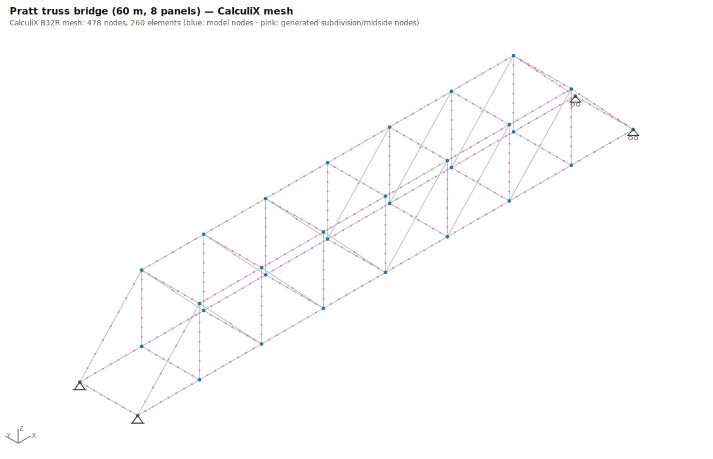
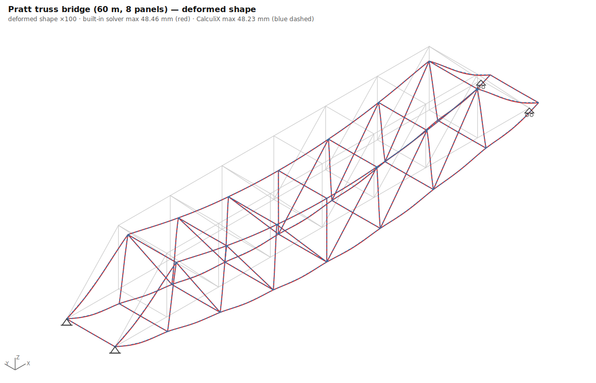
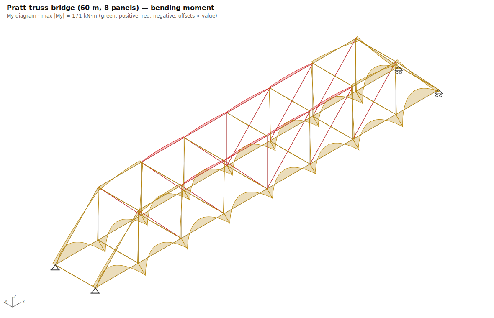
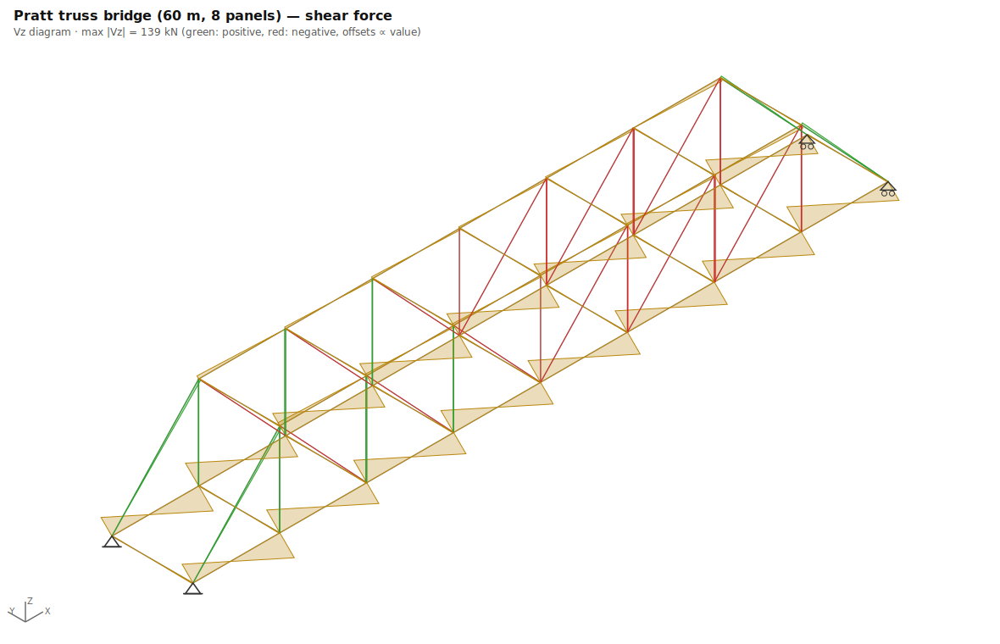
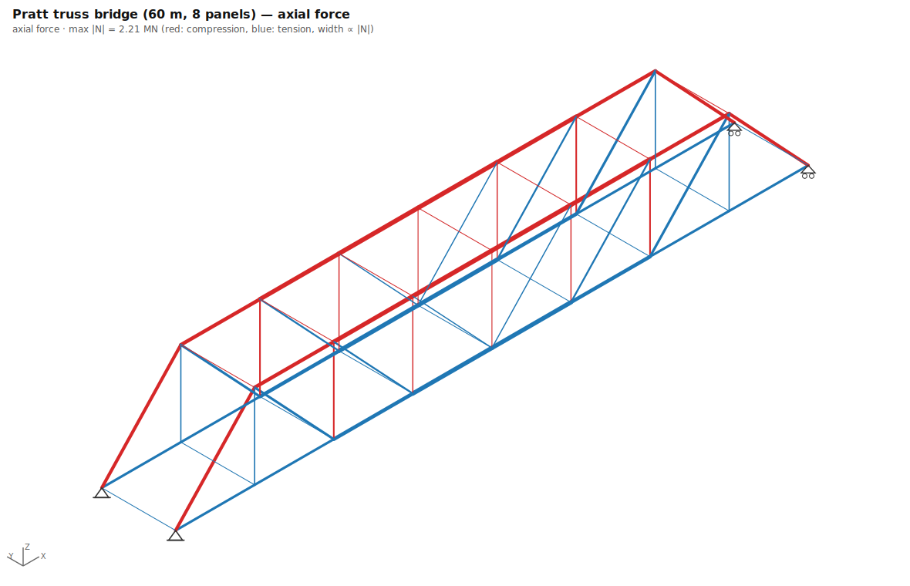
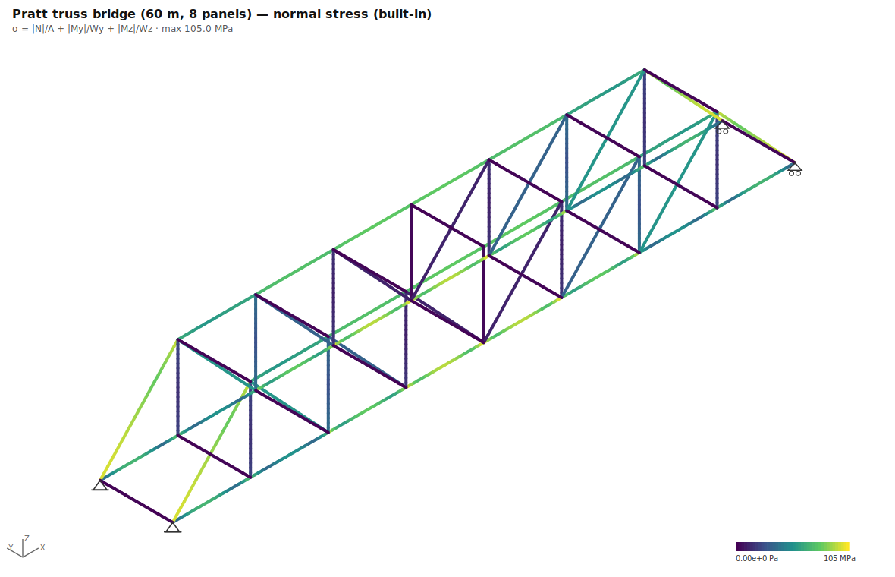
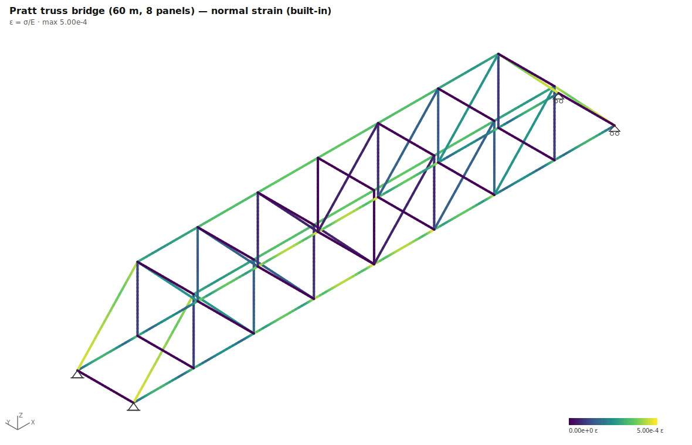
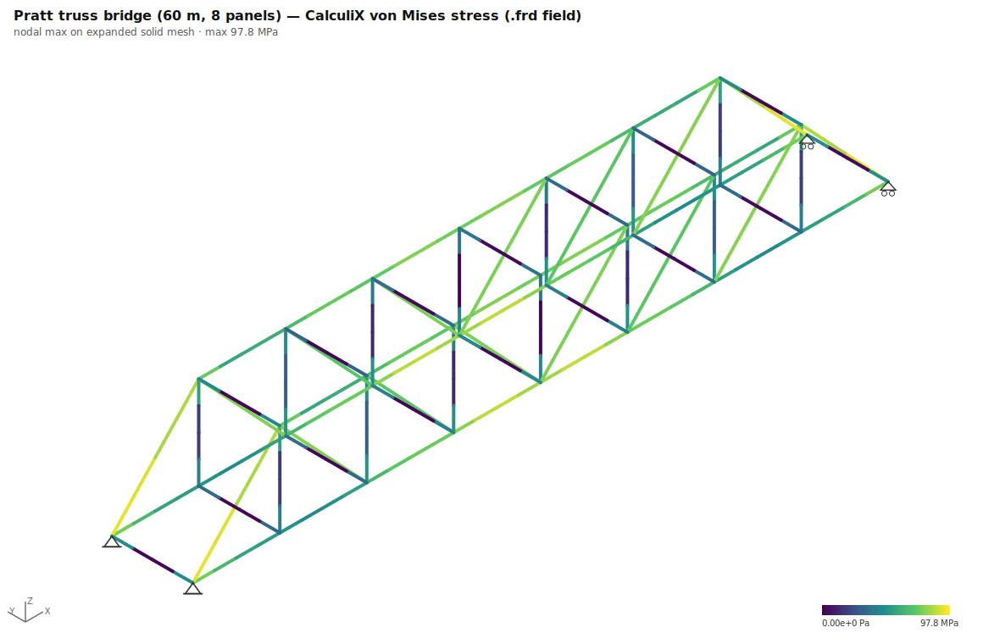
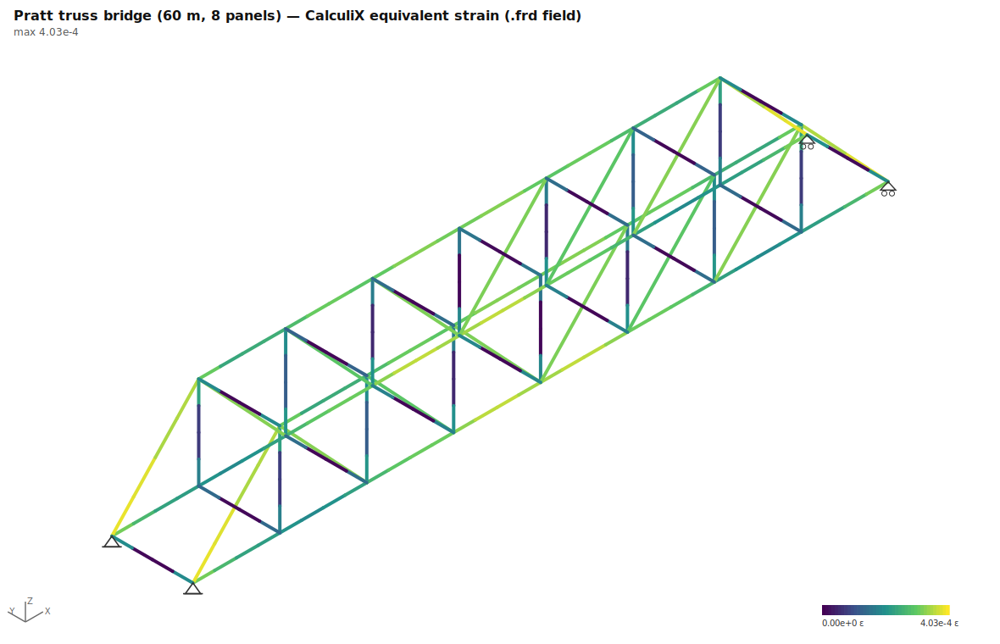

# 03 · Pratt truss bridge (60 m, 8 panels)

**Preset**: `truss_bridge` with `{"type":"pratt","span":60,"panels":8}`
**Load combination**: 1.00 × self-weight + 1.00 × deck UDL (30 kN/m per truss)
**Model**: 32 nodes, 74 members · **CalculiX mesh**: 478 nodes, 260 B32R elements

**Analytical basis**: Beam analogy for the truss: corner reaction R = W/4; end-post force R/sinθ (method of joints); mid bottom-chord force ≈ M(x)/h (method of sections).

## Geometry, supports & loads

## CalculiX mesh

## Deflections (built-in vs CalculiX)

## Internal forces (built-in solver)

## Stresses and strains

### CalculiX field output (.frd, expanded solid mesh)

## Key results

| Quantity | Built-in beam | CalculiX | Difference |
|---|---|---|---|
| Max deflection | 48.46 mm | 48.23 mm | 0.5% |
| ΣR vertical | 4603.0 kN | 4603.0 kN | 0.0% |
| Max normal stress / von Mises | 105.0 MPa | 97.8 MPa | 6.9% |
| Max strain (ε = σ/E / equiv.) | 5.00e-4 | 4.03e-4 | — (different strain measures) |
| Equilibrium ΣR = ΣF | satisfied (exact) | reactions parsed from .dat | |

*CalculiX reactions are RF at constrained DOFs corrected for loads applied at support nodes. Residual differences of a few % can remain where supports form expansion "knots" or members carry axial self-weight — a ccx printout artifact, not an equilibrium error.*

## Analytical checks

| Check | Formula | Analytical | Computed | Deviation | Tolerance | Pass |
|---|---|---|---|---|---|---|
| Corner reaction | `R = W/4` | 1150.7 | 1151.6 kN | 0.1% | ≤ 3% | ✅ |
| End-post axial force | `N = (R − w·s/2)/sinθ (compression)` | -1380.2 | -1430.6 kN | 3.6% | ≤ 6% | ✅ |
| Mid bottom-chord force | `N ≈ M(x)/h (tension)` | 2123.9 | 2071.9 kN | 2.4% | ≤ 8% | ✅ |

*(built-in solver values unless marked; CalculiX values from parsed `.dat`/`.frd` output; 441 ms total)*
