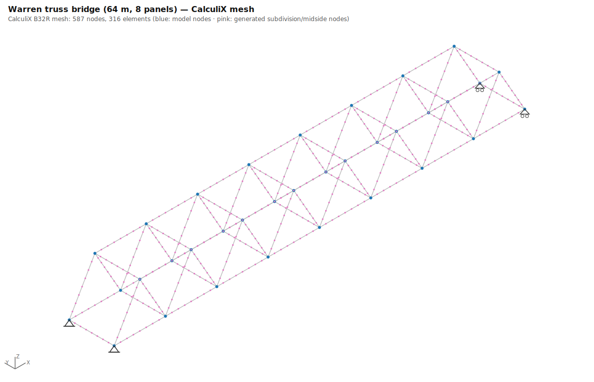
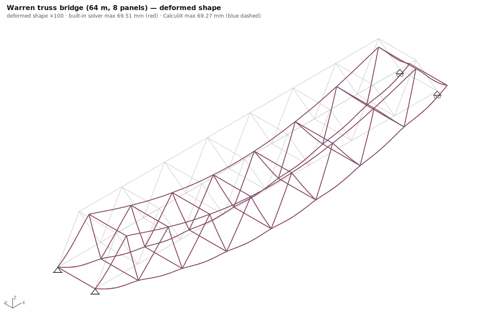
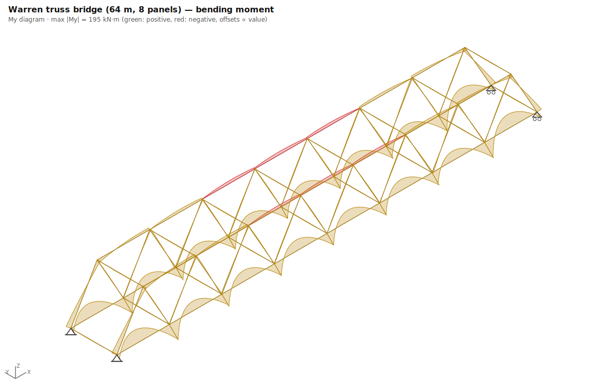
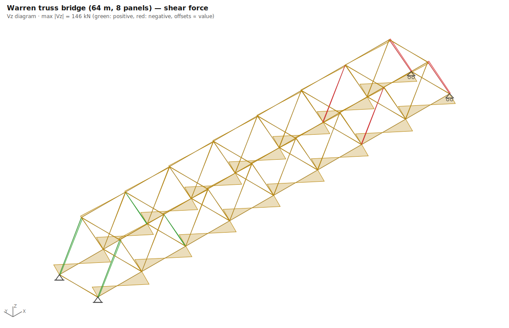
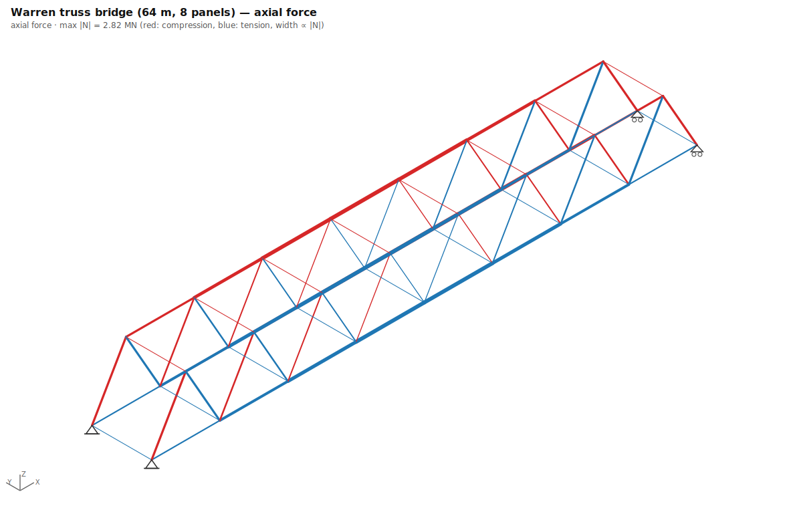
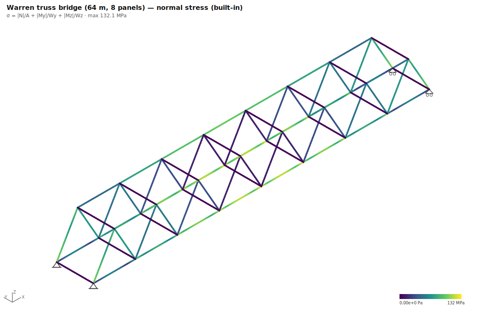
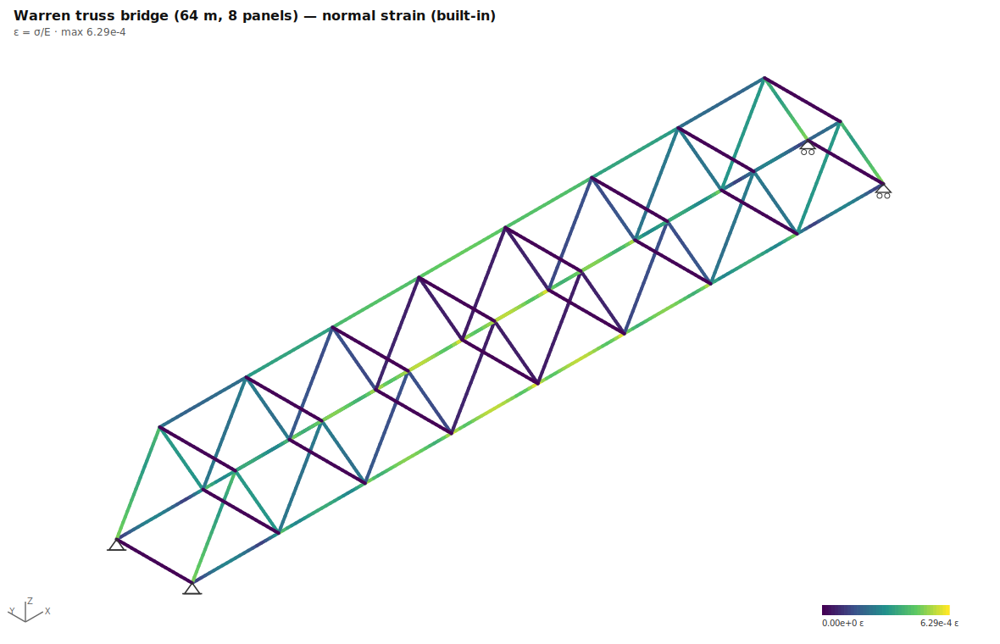
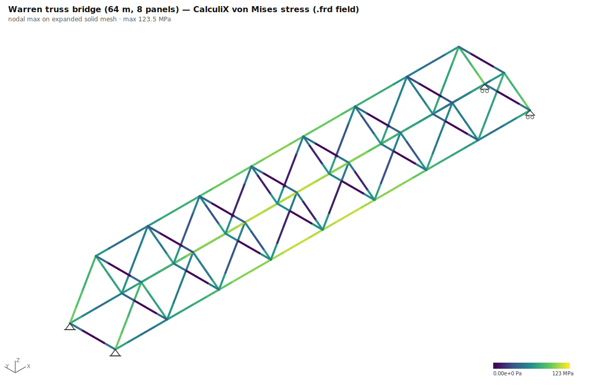
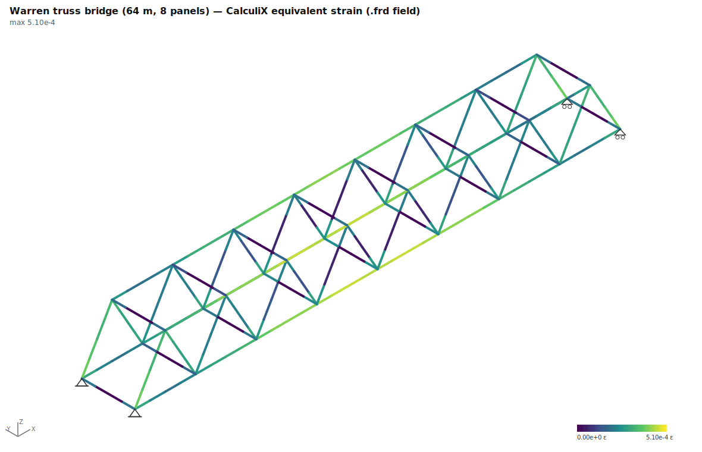

# 04 · Warren truss bridge (64 m, 8 panels)

**Preset**: `truss_bridge` with `{"type":"warren","span":64,"panels":8,"height":7}`
**Load combination**: 1.00 × self-weight + 1.00 × deck UDL (30 kN/m per truss)
**Model**: 34 nodes, 79 members · **CalculiX mesh**: 587 nodes, 316 B32R elements

**Analytical basis**: Beam analogy: first diagonal carries the panel shear, N = V/sinθ; mid bottom-chord force ≈ M(x)/h.

## Geometry, supports & loads

## CalculiX mesh

## Deflections (built-in vs CalculiX)

## Internal forces (built-in solver)

## Stresses and strains

### CalculiX field output (.frd, expanded solid mesh)

## Key results

| Quantity | Built-in beam | CalculiX | Difference |
|---|---|---|---|
| Max deflection | 69.51 mm | 69.27 mm | 0.3% |
| ΣR vertical | 4878.8 kN | 4878.8 kN | 0.0% |
| Max normal stress / von Mises | 132.1 MPa | 123.5 MPa | 6.5% |
| Max strain (ε = σ/E / equiv.) | 6.29e-4 | 5.10e-4 | — (different strain measures) |
| Equilibrium ΣR = ΣF | satisfied (exact) | reactions parsed from .dat | |

*CalculiX reactions are RF at constrained DOFs corrected for loads applied at support nodes. Residual differences of a few % can remain where supports form expansion "knots" or members carry axial self-weight — a ccx printout artifact, not an equilibrium error.*

## Analytical checks

| Check | Formula | Analytical | Computed | Deviation | Tolerance | Pass |
|---|---|---|---|---|---|---|
| Corner reaction | `R = W/4` | 1219.7 | 1220.4 kN | 0.1% | ≤ 3% | ✅ |
| First diagonal force | `N = (R − w·s/2)/sinθ (compression)` | -1229.2 | -1275.7 kN | 3.8% | ≤ 8% | ✅ |
| Mid bottom-chord force | `N ≈ M(x)/h (tension)` | 2744.3 | 2741.9 kN | 0.1% | ≤ 8% | ✅ |

*(built-in solver values unless marked; CalculiX values from parsed `.dat`/`.frd` output; 462 ms total)*
