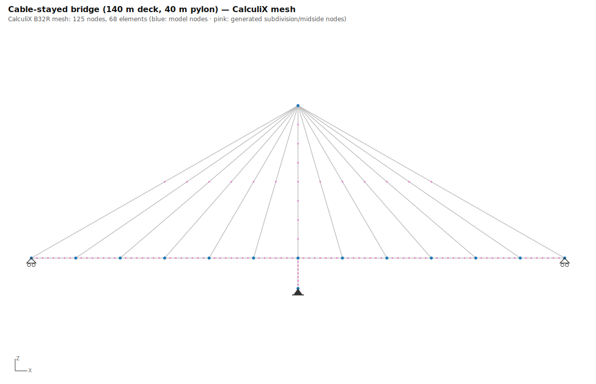
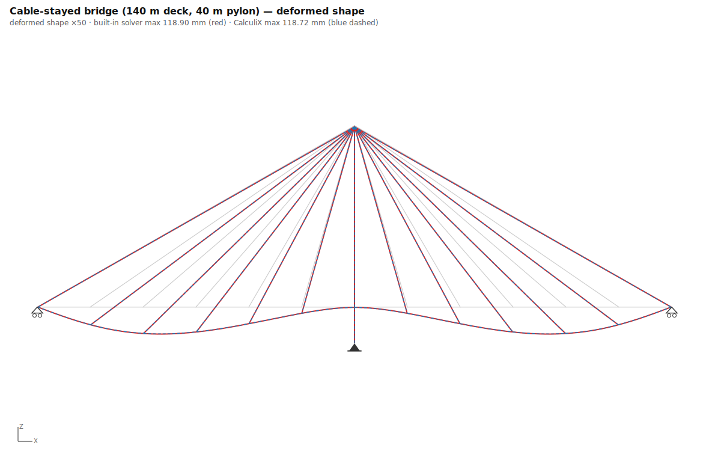
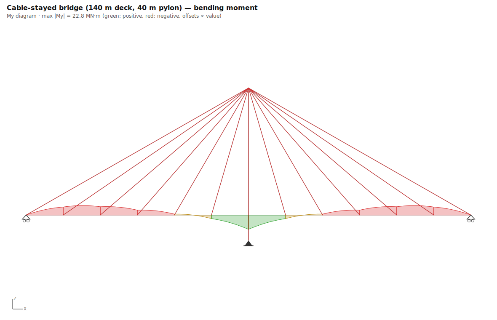
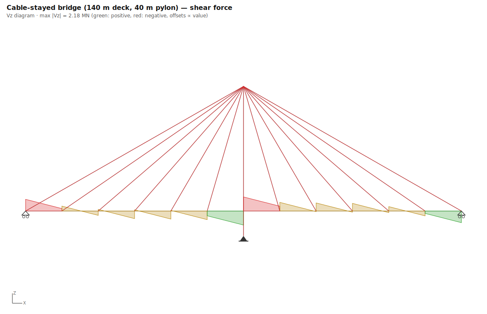
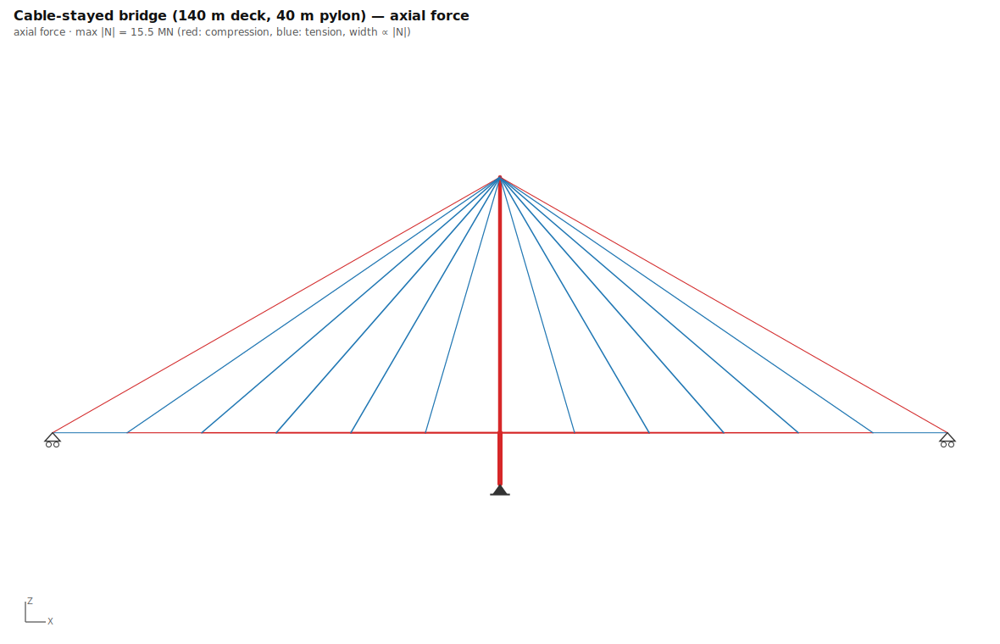
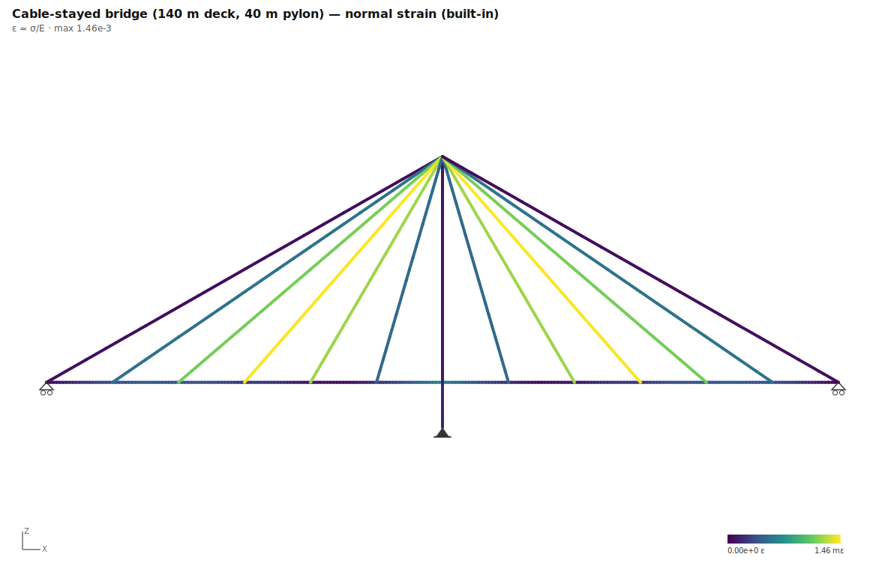
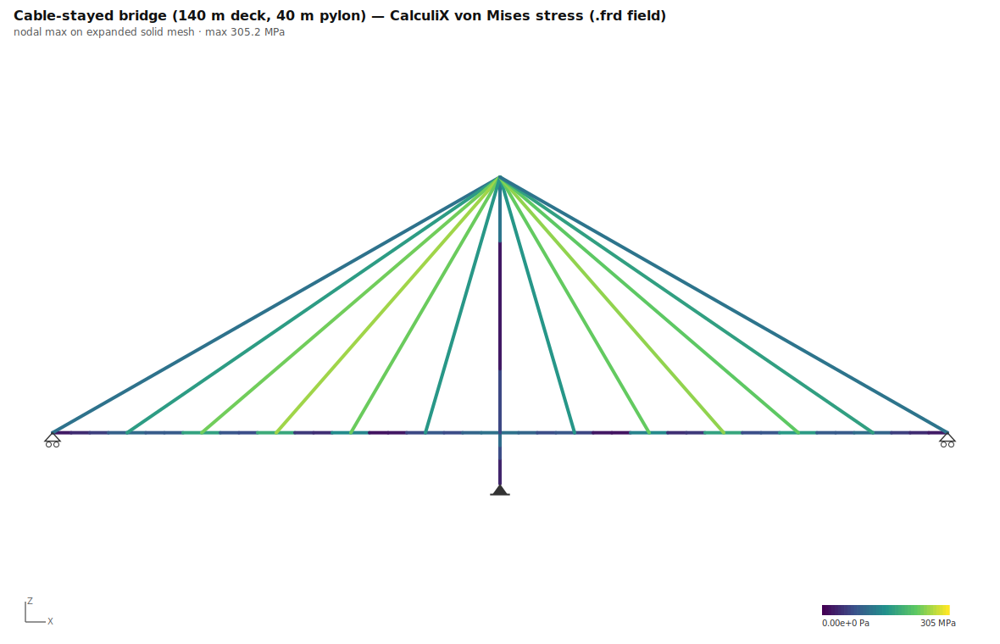
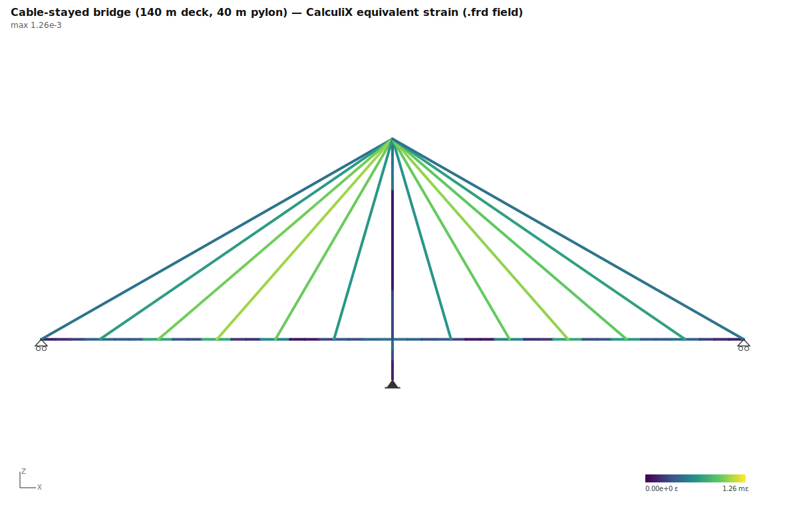

# 06 · Cable-stayed bridge (140 m deck, 40 m pylon)

**Preset**: `cable_stayed_bridge` with `{"deckLength":140,"towerHeight":40,"staysPerSide":6}`
**Load combination**: 1.00 × self-weight + 1.00 × deck UDL (100 kN/m)
**Model**: 15 nodes, 26 members · **CalculiX mesh**: 125 nodes, 68 B32R elements

**Analytical basis**: Tributary-length stay force: F ≈ w·s/sinα (α = stay inclination). The continuous deck redistributes load between stays, so ±15 % agreement is expected.

## Geometry, supports & loads

## CalculiX mesh

## Deflections (built-in vs CalculiX)

## Internal forces (built-in solver)

## Stresses and strains

### CalculiX field output (.frd, expanded solid mesh)

## Key results

| Quantity | Built-in beam | CalculiX | Difference |
|---|---|---|---|
| Max deflection | 118.90 mm | 118.72 mm | 0.2% |
| ΣR vertical | 19258.0 kN | 18265.3 kN | 5.2% |
| Max normal stress / von Mises | 306.8 MPa | 305.2 MPa | 0.5% |
| Max strain (ε = σ/E / equiv.) | 1.46e-3 | 1.26e-3 | — (different strain measures) |
| Equilibrium ΣR = ΣF | satisfied (exact) | reactions parsed from .dat | |

*CalculiX reactions are RF at constrained DOFs corrected for loads applied at support nodes. Residual differences of a few % can remain where supports form expansion "knots" or members carry axial self-weight — a ccx printout artifact, not an equilibrium error.*

## Analytical checks

| Check | Formula | Analytical | Computed | Deviation | Tolerance | Pass |
|---|---|---|---|---|---|---|
| Mid stay force (3rd from pylon) | `F ≈ w·s/sinα` | 1905.7 | 1841.0 kN | 3.4% | ≤ 15% | ✅ |
| Pylon axial below deck | `N ≈ −(W − R_ends)` | -15527.3 | -15527.3 kN | 0.0% | ≤ 5% | ✅ |
| Vertical equilibrium | `ΣR = W` | 19258.0 | 19258.0 kN | 0.0% | ≤ 0.1% | ✅ |

*(built-in solver values unless marked; CalculiX values from parsed `.dat`/`.frd` output; 126 ms total)*
