# 08 · 5-story, 3-bay moment frame

**Preset**: `moment_frame_building` with `{"stories":5,"bays":3}`
**Load combination**: 1.00 × self-weight + 1.00 × floor UDL (30 kN/m) + 1.00 × triangular lateral profile (up to 20 kN/floor)
**Model**: 24 nodes, 35 members · **CalculiX mesh**: 269 nodes, 140 B32R elements

**Analytical basis**: Global equilibrium of base shear and gravity, plus a plausibility band for the first-floor interior beam mid moment, wL²/16 ≤ M ≤ wL²/8 (frame end restraint lies between fixed and pinned).

## Geometry, supports & loads

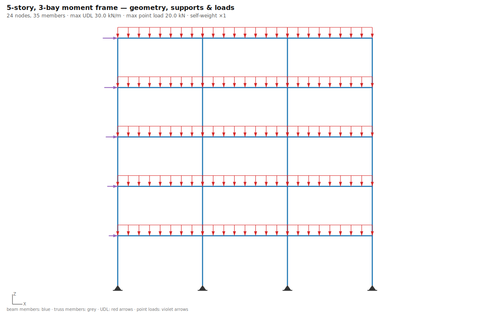

## CalculiX mesh

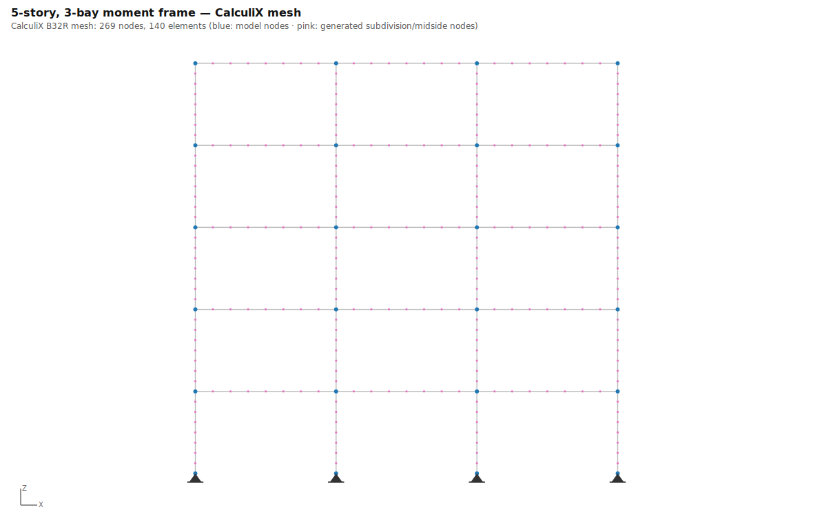

## Load cases

The combination above superposes the individual load cases (linear analysis). Deformed shapes:

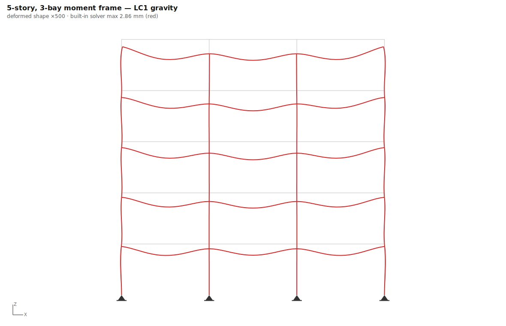
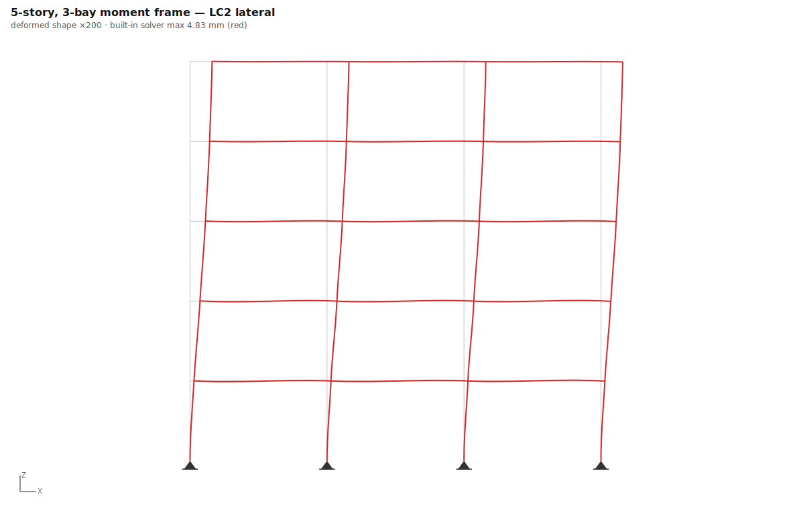

| Load case | max deflection |
|---|---|
| LC1 gravity | 2.86 mm |
| LC2 lateral | 4.83 mm |
| **Combination (all loads)** | **5.60 mm** |

**Superposition check** at node (0, 0, 17.5): combination ux = 4.95 mm vs LC1+LC2 = 4.95 mm; uz = -0.93 mm vs -0.93 mm — linear superposition holds.

## Deflections (built-in vs CalculiX)

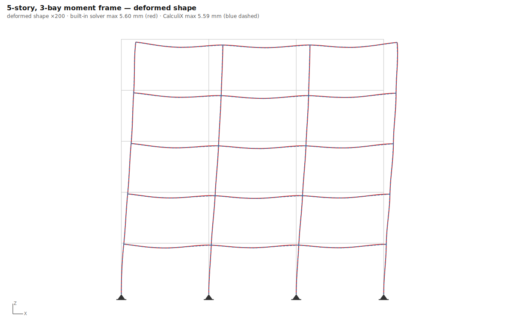

## Internal forces (built-in solver)

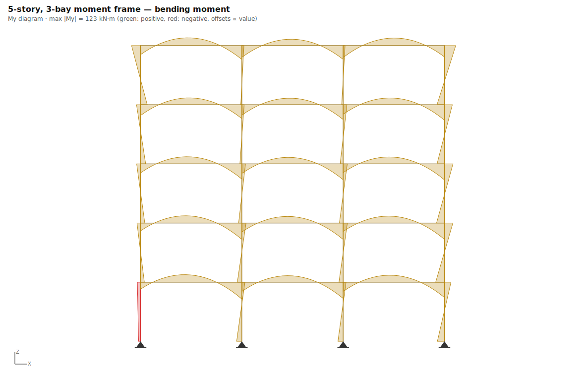
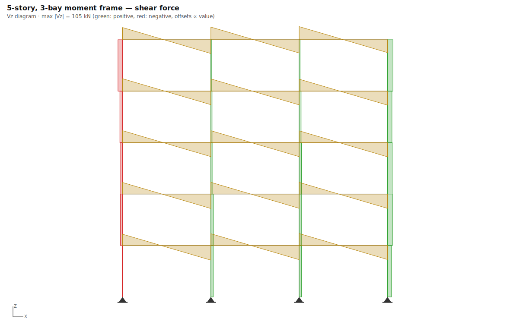
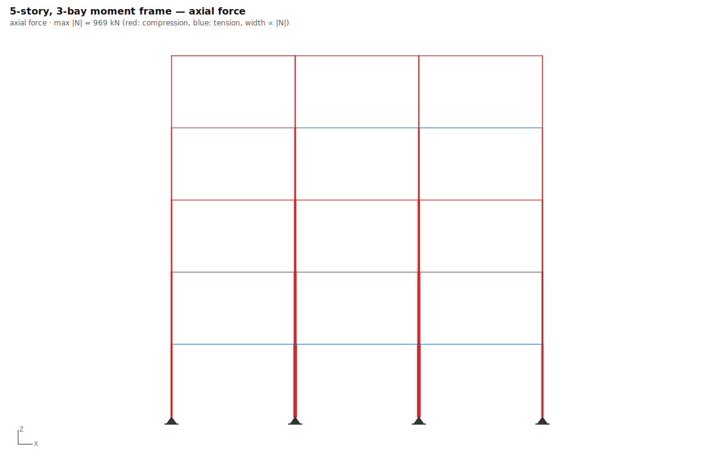

## Stresses and strains

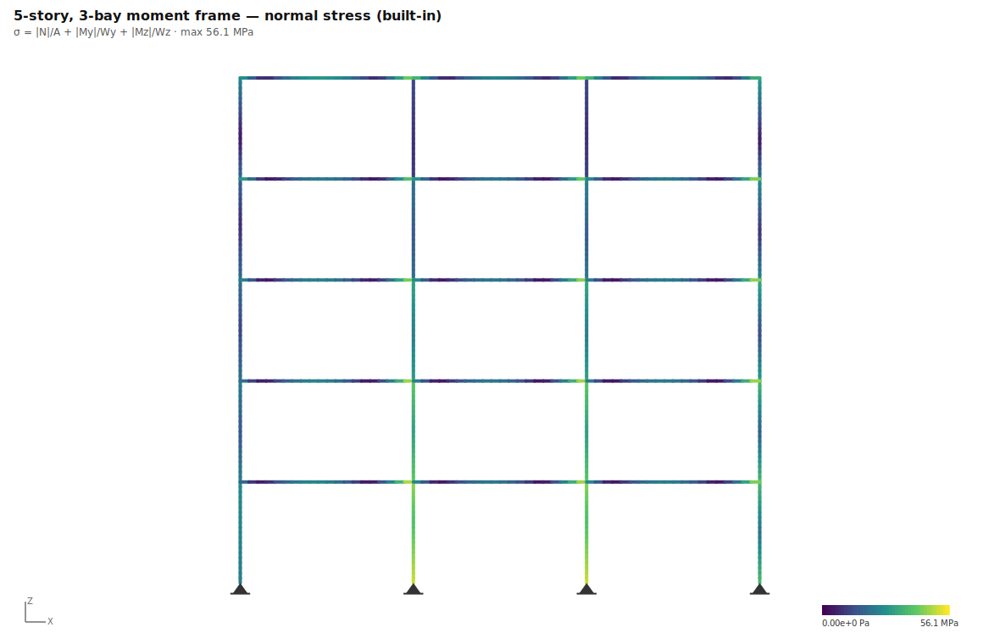

### CalculiX field output (.frd, expanded solid mesh)

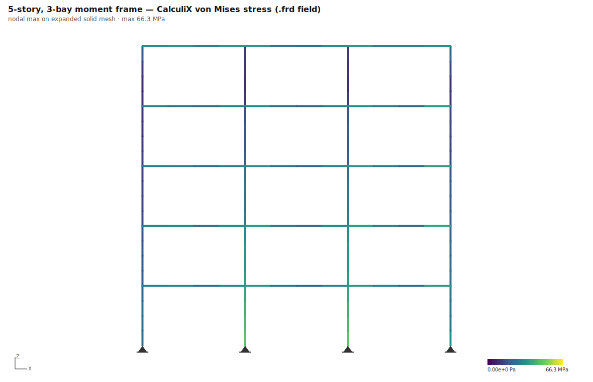
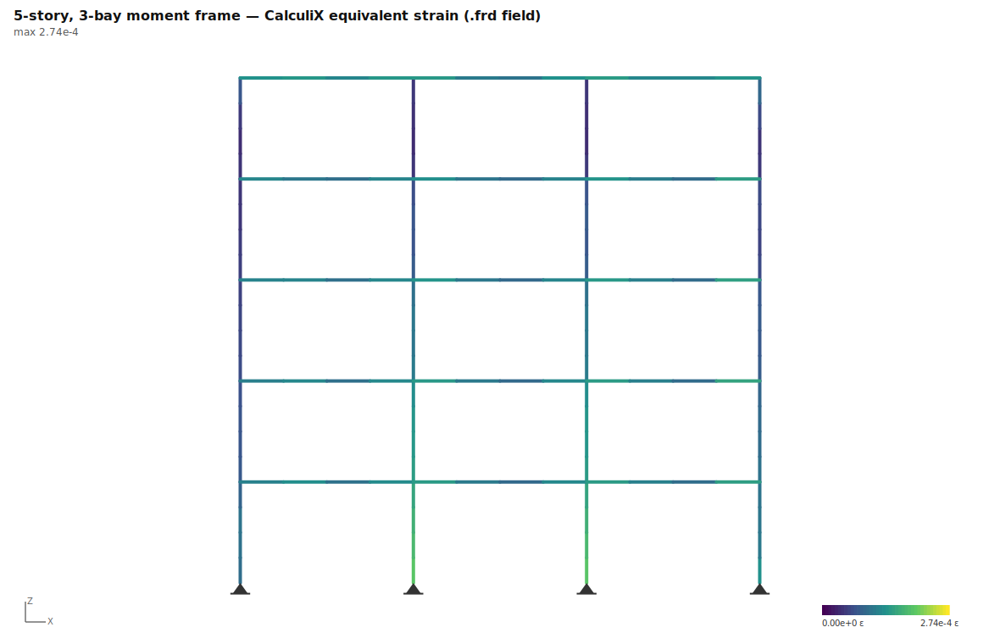

## Key results

| Quantity | Built-in beam | CalculiX | Difference |
|---|---|---|---|
| Max deflection | 5.60 mm | 5.59 mm | 0.3% |
| ΣR vertical | 2920.3 kN | 2833.5 kN | 3.0% |
| Max normal stress / von Mises | 56.1 MPa | 66.3 MPa | 18.2% |
| Max strain (ε = σ/E / equiv.) | 2.67e-4 | 2.74e-4 | — (different strain measures) |
| Equilibrium ΣR = ΣF | satisfied (exact) | reactions parsed from .dat | |

*CalculiX reactions are RF at constrained DOFs corrected for loads applied at support nodes. Residual differences of a few % can remain where supports form expansion "knots" or members carry axial self-weight — a ccx printout artifact, not an equilibrium error.*

## Analytical checks

| Check | Formula | Analytical | Computed | Deviation | Tolerance | Pass |
|---|---|---|---|---|---|---|
| Base shear | `ΣH = Σ lateral loads` | 60.0 | 60.0 kN | 0.0% | ≤ 0.1% | ✅ |
| Vertical equilibrium | `ΣV = W` | 2920.3 | 2920.3 kN | 0.0% | ≤ 0.1% | ✅ |
| Interior beam mid moment | `wL²/16 ≤ M ≤ wL²/8 (band midpoint shown)` | 104.5 | 47.3 kN·m | 54.7% | ≤ 55% | ✅ |

*(built-in solver values unless marked; CalculiX values from parsed `.dat`/`.frd` output; 255 ms total)*
